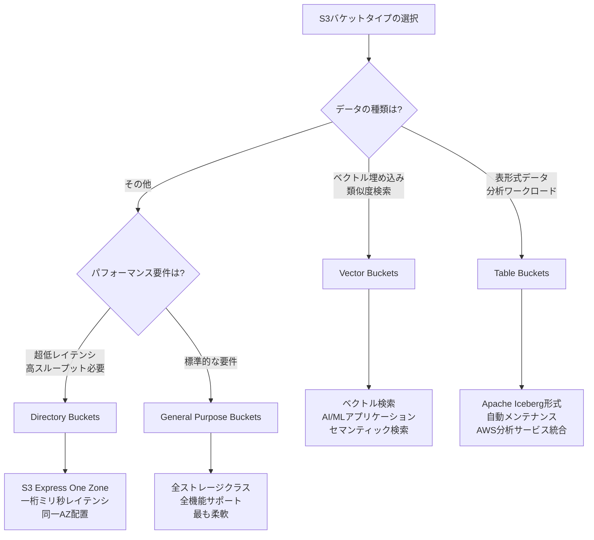

# Amazon S3 サービス種類の比較

## 目次

- [概要](#概要)
- [S3バケットタイプ](#s3バケットタイプ)
  - [General Purpose Buckets](#general-purpose-buckets)
  - [Directory Buckets](#directory-buckets)
  - [Table Buckets](#table-buckets)
  - [Vector Buckets](#vector-buckets)
- [バケットタイプ比較表](#バケットタイプ比較表)
- [選択ガイド](#選択ガイド)
- [ベストプラクティス](#ベストプラクティス)
- [出典](#出典)

---

## 概要

Amazon S3は、用途に応じて最適化された複数のバケットタイプを提供しています。本ドキュメントでは、各バケットタイプの特徴、ユースケース、制限事項を比較し、適切な選択をサポートします。

### 対象読者

- S3の利用を検討しているアーキテクト
- バケットタイプの選択に悩んでいるエンジニア
- S3サービス全体の理解を深めたい技術者

### 4つのバケットタイプ

Amazon S3は以下の4つのバケットタイプを提供しています：

1. **General Purpose Buckets（汎用バケット）**: 最も一般的なバケットタイプ。幅広いユースケースに対応
2. **Directory Buckets（ディレクトリバケット）**: 階層構造と高性能を提供。S3 Express One Zoneストレージクラス専用
3. **Table Buckets（テーブルバケット）**: Apache Iceberg形式の表形式データ専用。分析ワークロード最適化
4. **Vector Buckets（ベクトルバケット）**: ベクトル埋め込みの保存と類似度検索専用。AI/MLアプリケーション最適化（プレビュー）

---

## S3バケットタイプ

### General Purpose Buckets

#### 概要

General Purpose Buckets（汎用バケット）は、Amazon S3の標準的なバケットタイプです。最も広く使用されており、ほとんどのユースケースに対応できる柔軟性を持っています。

#### 主要な特徴

| 特徴 | 詳細 |
|------|------|
| **命名** | グローバルに一意な名前が必要（全AWSアカウント、全リージョン） |
| **リージョン** | 任意のAWSリージョンで作成可能 |
| **ストレージクラス** | 全てのS3ストレージクラスをサポート |
| **データ構造** | フラットな名前空間（プレフィックスで階層を模倣） |
| **可用性** | リージョン内の複数のアベイラビリティゾーンに分散 |
| **パフォーマンス** | 標準的なパフォーマンス（リクエストレート制限あり） |

#### サポートされる機能

General Purpose Bucketsは、S3の全機能をサポートしています：

- **ストレージ管理**: Lifecycle、Object Lock、Replication、Batch Operations
- **アクセス管理**: IAM、Bucket Policies、ACLs、Access Points、Block Public Access
- **データ処理**: Object Lambda、Event Notifications
- **監視**: CloudWatch、CloudTrail、Server Access Logging
- **分析**: Storage Lens、Storage Class Analysis
- **その他**: Versioning、Transfer Acceleration、Static Website Hosting

#### ユースケース

- **Webサイトホスティング**: 静的Webサイトのホスティング
- **データレイク**: 大規模なデータレイクの構築
- **バックアップとアーカイブ**: データのバックアップと長期保存
- **アプリケーションデータ**: モバイルアプリやエンタープライズアプリのデータストレージ
- **コンテンツ配信**: CloudFrontと組み合わせたコンテンツ配信
- **ビッグデータ分析**: Athena、EMR、Redshift Spectrumとの統合

#### 制限事項

| 項目 | 制限値 |
|------|--------|
| **バケット数** | アカウントあたり100個（デフォルト、増加申請可能） |
| **バケット名の長さ** | 3〜63文字 |
| **オブジェクト数** | 無制限 |
| **オブジェクトサイズ** | 最大5TB |
| **リクエストレート** | プレフィックスあたり3,500 PUT/COPY/POST/DELETE、5,500 GET/HEAD |

#### 料金

General Purpose Bucketsの料金は、以下の要素で構成されます：

- **ストレージ料金**: 選択したストレージクラスに応じて課金
- **リクエスト料金**: PUT、GET、その他のAPIリクエストに対して課金
- **データ転送料金**: インターネットへのデータ転送に対して課金
- **管理機能料金**: Replication、Inventory、Analyticsなどの機能に対して課金

---

### Directory Buckets

#### 概要

Directory Buckets（ディレクトリバケット）は、階層構造のデータ組織と高性能アクセスを提供する特殊なバケットタイプです。S3 Express One Zoneストレージクラス専用に設計されています。

#### 主要な特徴

| 特徴 | 詳細 |
|------|------|
| **命名** | `bucket-base-name--zone-id--x-s3` 形式（ゾーンIDを含む） |
| **リージョン** | 単一のアベイラビリティゾーンまたはLocal Zoneに配置 |
| **ストレージクラス** | S3 Express One Zone専用 |
| **データ構造** | 階層構造（真のディレクトリ） |
| **可用性** | 単一ゾーン内の複数デバイスに分散 |
| **パフォーマンス** | 超高性能（最大200,000 read TPS、100,000 write TPS） |

#### パフォーマンス特性

Directory Bucketsは、S3 Express One Zoneストレージクラスと組み合わせることで、以下の性能を実現します：

- **レイテンシ**: 一桁ミリ秒（single-digit millisecond）
- **スループット**: S3 Standardの最大10倍高速
- **リクエストコスト**: S3 Standardの50%低コスト
- **Read TPS**: バケットあたり最大200,000 TPS
- **Write TPS**: バケットあたり最大100,000 TPS

#### サポートされる機能

Directory Bucketsは、一部の機能のみをサポートします：

**サポートされる機能**:
- IAMポリシー
- Bucket Policies
- Access Points
- CloudWatch Metrics
- CloudTrail Logging
- VPC Endpoints

**サポートされない機能**:
- ACLs（常に無効）
- Object Lock
- Versioning
- Replication
- Lifecycle
- Static Website Hosting
- Transfer Acceleration
- Public Access（常にブロック）

#### ユースケース

- **低レイテンシアプリケーション**: ミリ秒単位のレスポンスが必要なアプリケーション
- **高スループットワークロード**: 大量のリクエストを処理するワークロード
- **機械学習**: トレーニングデータへの高速アクセス
- **リアルタイム分析**: ストリーミングデータの高速処理
- **コンピュートとの同一配置**: EC2インスタンスと同じAZに配置してレイテンシを最小化

#### 制限事項

| 項目 | 制限値 |
|------|--------|
| **バケット数** | アカウントあたり100個（デフォルト、増加申請可能） |
| **バケット名の形式** | `bucket-base-name--zone-id--x-s3` 形式必須 |
| **オブジェクト数** | 無制限 |
| **オブジェクトサイズ** | 最大5TB |
| **非アクティブ期間** | 90日間アクセスがないと非アクティブ状態に移行 |

#### 料金

Directory Bucketsの料金は、S3 Express One Zoneストレージクラスの料金体系に従います：

- **ストレージ料金**: S3 Standardより高額（高性能のため）
- **リクエスト料金**: S3 Standardの50%低コスト
- **データ転送料金**: 標準的なデータ転送料金

---

### Table Buckets

#### 概要

Table Buckets（テーブルバケット）は、Apache Iceberg形式の表形式データ専用に設計された特殊なバケットタイプです。分析ワークロードに最適化されており、自動メンテナンス機能を提供します。

#### 主要な特徴

| 特徴 | 詳細 |
|------|------|
| **命名** | グローバルに一意な名前が必要 |
| **リージョン** | 任意のAWSリージョンで作成可能 |
| **データ形式** | Apache Iceberg形式専用 |
| **データ構造** | Namespace（データベース）とTable（テーブル）の階層構造 |
| **可用性** | リージョン内の複数のアベイラビリティゾーンに分散 |
| **自動メンテナンス** | コンパクション、スナップショット管理、未参照ファイル削除 |

#### Apache Iceberg統合

Table Bucketsは、Apache Icebergフォーマットをネイティブにサポートします：

- **ACID トランザクション**: 完全なACID保証
- **スキーマ進化**: テーブルスキーマの柔軟な変更
- **パーティション進化**: パーティション戦略の変更
- **タイムトラベル**: 過去の任意の時点のデータにアクセス
- **標準SQLクエリ**: Athena、EMR、Redshiftなどから直接クエリ可能

#### 自動メンテナンス機能

Table Bucketsは、以下のメンテナンス作業を自動的に実行します：

1. **コンパクション**: 小さなファイルを大きなファイルに統合（4つの戦略）
   - Auto: 自動選択
   - Binpack: ファイル統合
   - Sort: ソート順序最適化
   - Z-order: 多次元インデックス最適化

2. **スナップショット管理**: 古いスナップショットの自動削除
   - 最小スナップショット数の維持
   - 最大保持期間の設定

3. **未参照ファイル削除**: 使用されていないファイルの自動削除
   - デフォルト3日間の保持期間
   - ストレージコストの削減

#### サポートされる機能

**サポートされる機能**:
- IAMポリシー
- Resource-based Policies
- AWS Lake Formation統合
- AWS Glue Data Catalog統合
- CloudWatch Metrics
- CloudTrail Logging
- VPC Endpoints
- SSE-S3暗号化（デフォルト）
- SSE-KMS暗号化（カスタマー管理キー）
- タグ（ABAC、コスト配分）

**サポートされない機能**:
- ACLs
- Object Lock
- Versioning
- Replication
- Static Website Hosting
- Transfer Acceleration
- Public Access（常にブロック）
- Presigned URLs
- HTTP（HTTPS必須）

#### ユースケース

- **データレイクハウス**: 構造化データの大規模分析
- **ETLパイプライン**: データ変換と集約
- **ストリーミング分析**: Firehoseとの統合によるリアルタイム取り込み
- **機械学習**: SageMaker Lakehouseとの統合
- **BI/レポーティング**: QuickSightとの統合
- **データ共有**: Snowflake、Databricksとの外部アクセス

#### 制限事項

| 項目 | 制限値 |
|------|--------|
| **Table Buckets数** | リージョンあたり10個（デフォルト、増加申請可能） |
| **Namespaces数** | Table Bucketあたり10,000個 |
| **Tables数** | Table Bucketあたり10,000個 |
| **Namespace階層** | 単一レベルのみ（ネスト不可） |
| **テーブル名** | 小文字のみ（大文字不可） |
| **マネジメントコンソール削除** | 非対応（CLI/SDK/API必須） |

#### 料金

Table Bucketsの料金は、以下の要素で構成されます：

- **ストレージ料金**: データストレージ（階層型料金）
- **リクエスト料金**: PUT、GET、その他のAPIリクエスト
- **オブジェクトモニタリング料金**: メタデータ管理
- **メンテナンス料金**: コンパクション、圧縮処理
- **データ転送料金**: インターネットへのデータ転送

---

### Vector Buckets

###### 注意

Amazon S3 Vectorsはプレビューリリース中であり、変更される可能性があります。

#### 概要

Vector Buckets（ベクトルバケット）は、ベクトル埋め込みの保存と類似度検索に特化した新しいバケットタイプです。セマンティック検索やAIアプリケーション向けに設計されており、コスト最適化されたベクトルストレージを提供します。

#### 主要な特徴

| 特徴 | 詳細 |
|------|------|
| **命名** | 標準的なバケット命名規則に従う |
| **リージョン** | 限定的なリージョンで利用可能（5リージョン） |
| **サービスネームスペース** | `s3vectors`（Amazon S3とは別） |
| **ARN形式** | `arn:aws:s3vectors:Region:OwnerAccountID:bucket/bucket-name` |
| **データ構造** | Vector Indexes（ベクトルインデックス） |
| **可用性** | リージョン内で高可用性（詳細未公開） |
| **パフォーマンス** | Sub-second query performance |

#### 主要コンポーネント

Vector Bucketsは、以下の3つの主要コンポーネントで構成されます：

1. **Vector Buckets（ベクトルバケット）**
   - ベクトルデータの保存とクエリ専用の新しいバケットタイプ
   - 専用のAPI操作セットを提供
   - インフラストラクチャのプロビジョニング不要

2. **Vector Indexes（ベクトルインデックス）**
   - バケット内でベクトルデータを整理
   - 類似度検索を実行する単位
   - バケットあたり最大10,000インデックス

3. **Vectors（ベクトル）**
   - ベクトル埋め込み（テキスト、画像、音声の数値表現）
   - セマンティックな関係性を保持
   - メタデータの添付が可能

#### パフォーマンス特性

Vector Bucketsは、以下のパフォーマンス特性を提供します：

**書き込み性能**:
- **Write TPS**: インデックスあたり最低5リクエスト/秒
- **強い整合性**: 書き込み後即座にアクセス可能
- **バッチ処理**: 最大500ベクトル/リクエスト

**読み取り・クエリ性能**:
- **Query TPS**: インデックスあたり数百リクエスト/秒
- **レイテンシ**: Sub-second response times
- **Top-K検索**: 最大30件の類似ベクトルを返却

**自動最適化**:
- ベクトルデータの自動最適化
- データセットのスケール・進化に対応
- 最適な価格性能を維持

#### サポートされる機能

**サポートされる機能**:
- IAM identity-based policies
- Bucket policies
- Service Control Policies（AWS Organizations）
- VPC endpoints（PrivateLinkは非対応）
- CloudWatch Metrics
- CloudTrail Logging
- 暗号化（SSE-S3、SSE-KMS）
- メタデータフィルタリング（string、number、boolean、list）
- 類似度検索（Approximate Nearest Neighbor）

**サポートされない機能**:
- ACLs
- Public Access（常にブロック）
- Versioning
- Object Lock
- Replication
- Lifecycle
- Static Website Hosting
- Transfer Acceleration
- Gateway VPC endpoints
- AWS PrivateLink（プレビュー時点）

#### ユースケース

Vector Bucketsは、以下のようなユースケースに最適です：

- **医療画像の類似性検索**: 数百万の医療画像から類似画像を検索し、診断・治療計画を支援
- **著作権侵害の検出**: 大規模なメディアライブラリから派生コンテンツを特定
- **画像の重複排除**: 大規模な画像コレクションから重複・類似画像を検出・削除
- **動画コンテンツの理解**: 動画アセット内の特定シーンやコンテンツを検索
- **企業文書のセマンティック検索**: 企業文書全体から意味に基づいて関連情報を検索
- **パーソナライゼーション**: 類似アイテムを見つけてカスタマイズされた推奨を提供

#### AWS統合

Vector Bucketsは、以下のAWSサービスと統合できます：

**Amazon OpenSearch Service**:
- ベクトルストレージコストの最適化
- OpenSearch API操作の継続利用
- ハイブリッド検索、集約、高度なフィルタリング、ファセット検索
- OpenSearch Serverlessへのスナップショットエクスポート（高QPS・低レイテンシ検索）

**Amazon Bedrock Knowledge Bases**:
- RAG（Retrieval Augmented Generation）アプリケーション向けベクトルストア
- ストレージコストの削減

**Amazon Bedrock in SageMaker Unified Studio**:
- ナレッジベースの開発・テスト
- Vector Bucketsをベクトルストアとして利用

#### 制限事項

| 項目 | 制限値 |
|------|--------|
| **Vector Buckets数** | リージョンあたり10,000個 |
| **Vector Indexes数** | バケットあたり10,000個 |
| **Vectors数** | インデックスあたり最大5,000万個 |
| **ベクトル次元数** | 1〜4,096次元 |
| **メタデータ合計** | ベクトルあたり最大40 KB |
| **メタデータキー数** | ベクトルあたり最大10個 |
| **Filterable metadata** | ベクトルあたり最大2 KB |
| **Non-filterable metadata keys** | インデックスあたり最大10個 |
| **Write requests** | インデックスあたり最大5リクエスト/秒 |
| **Request payload size** | 最大20 MiB |
| **PutVectors API** | 最大500ベクトル/コール |
| **DeleteVectors API** | 最大500ベクトル/コール |
| **GetVectors API** | 最大100ベクトル/コール |
| **QueryVectors API** | 最大30件のTop-K結果 |

#### 対応リージョン

Vector Bucketsは、以下のAWSリージョンで利用可能です（プレビュー時点）：

| リージョン名 | リージョンコード | エンドポイント |
|-------------|----------------|---------------|
| US East (N. Virginia) | us-east-1 | s3vectors.us-east-1.api.aws |
| US East (Ohio) | us-east-2 | s3vectors.us-east-2.api.aws |
| US West (Oregon) | us-west-2 | s3vectors.us-west-2.api.aws |
| EU Central 1 (Frankfurt) | eu-central-1 | s3vectors.eu-central-1.api.aws |
| Asia Pacific (Sydney) | ap-southeast-2 | s3vectors.ap-southeast-2.api.aws |

**注意**: 東京リージョン（ap-northeast-1）は現時点で未対応です。

#### 料金

Vector Bucketsの料金は、以下の要素で構成されます：

- **ストレージ料金**: ベクトルデータの保存
- **リクエスト料金**: PUT、GET、Query、その他のAPIリクエスト
- **データ転送料金**: インターネットへのデータ転送

**注意**: プレビュー機能のため、詳細な料金情報はAWS公式料金ページを参照してください。
- AWS公式料金ページ: https://aws.amazon.com/s3/pricing/

---

## バケットタイプ比較表

### 基本仕様比較

| 項目 | General Purpose | Directory | Table | Vector |
|------|----------------|-----------|-------|--------|
| **主な用途** | 汎用 | 高性能アクセス | 分析ワークロード | ベクトル検索・AI/ML |
| **データ構造** | フラット | 階層構造 | Namespace/Table | Vector Indexes |
| **ストレージクラス** | 全クラス | Express One Zone | Standard（デフォルト） | 専用（詳細未公開） |
| **可用性** | マルチAZ | シングルAZ | マルチAZ | リージョン内（詳細未公開） |
| **命名規則** | グローバル一意 | ゾーンID含む | グローバル一意 | 標準的な命名規則 |
| **バケット数制限** | 100 | 100 | 10/Region | 10,000/Region |

### パフォーマンス比較

| 項目 | General Purpose | Directory | Table | Vector |
|------|----------------|-----------|-------|--------|
| **Read TPS** | 5,500/prefix | 200,000/bucket | 標準 | 数百/index |
| **Write TPS** | 3,500/prefix | 100,000/bucket | 標準 | 5/index（最低） |
| **レイテンシ** | 標準 | 一桁ミリ秒 | 標準 | Sub-second |
| **スループット** | 標準 | 10倍高速 | 標準 | 標準 |

### 機能サポート比較

| 機能 | General Purpose | Directory | Table | Vector |
|------|----------------|-----------|-------|--------|
| **Versioning** | ✅ | ❌ | ❌ | ❌ |
| **Object Lock** | ✅ | ❌ | ❌ | ❌ |
| **Replication** | ✅ | ❌ | ❌ | ❌ |
| **Lifecycle** | ✅ | ❌ | ❌ | ❌ |
| **ACLs** | ✅ | ❌ | ❌ | ❌ |
| **Public Access** | ✅ | ❌ | ❌ | ❌ |
| **Static Website** | ✅ | ❌ | ❌ | ❌ |
| **Transfer Acceleration** | ✅ | ❌ | ❌ | ❌ |
| **Access Points** | ✅ | ✅ | ❌ | ❌ |
| **VPC Endpoints** | ✅ | ✅ | ✅ | ✅ |
| **CloudTrail** | ✅ | ✅ | ✅ | ✅ |
| **自動メンテナンス** | ❌ | ❌ | ✅ | ✅（自動最適化） |

---

## 選択ガイド

### 選択フローチャート

### 選択基準

#### General Purpose Bucketsを選択すべき場合

- 汎用的なオブジェクトストレージが必要
- 複数のストレージクラスを使い分けたい
- Versioning、Object Lock、Replicationなどの機能が必要
- 静的Webサイトホスティングを行いたい
- 既存のS3ワークロードを移行したい

#### Directory Bucketsを選択すべき場合

- 一桁ミリ秒のレイテンシが必要
- 高いリクエストレート（200K read TPS、100K write TPS）が必要
- コンピュートリソースと同じAZに配置したい
- 機械学習のトレーニングデータに高速アクセスしたい
- リアルタイム分析を行いたい

#### Table Bucketsを選択すべき場合

- Apache Iceberg形式の表形式データを扱う
- 分析ワークロード（Athena、EMR、Redshift）を実行する
- 自動メンテナンス機能が必要
- ACID トランザクションが必要
- データレイクハウスを構築したい

#### Vector Bucketsを選択すべき場合

- ベクトル埋め込みの保存と類似度検索が必要
- AI/MLアプリケーションを構築したい
- セマンティック検索を実装したい
- RAG（Retrieval Augmented Generation）アプリケーションを開発したい
- OpenSearch、Bedrock、SageMakerと統合したい
- コスト最適化されたベクトルストレージが必要

---

## ベストプラクティス

### General Purpose Buckets

1. **適切なストレージクラスの選択**
   - アクセスパターンに応じてストレージクラスを選択
   - Lifecycleポリシーで自動移行を設定

2. **パフォーマンス最適化**
   - プレフィックスを分散してリクエストレートを向上
   - CloudFrontと組み合わせてレイテンシを削減

3. **セキュリティ**
   - Block Public Accessを有効化
   - Bucket Policyで最小権限の原則を適用
   - 暗号化を有効化（SSE-S3またはSSE-KMS）

### Directory Buckets

1. **配置戦略**
   - コンピュートリソースと同じAZに配置
   - レイテンシを最小化するためのネットワーク設計

2. **非アクティブ状態の管理**
   - 90日間のアクセスがないと非アクティブ状態に移行
   - 定期的なアクセスまたは削除を計画

3. **コスト最適化**
   - 高性能が必要なデータのみをDirectory Bucketsに配置
   - 他のデータはGeneral Purpose Bucketsに配置

### Table Buckets

1. **命名規則**
   - テーブル名、カラム名は小文字のみを使用
   - AWS分析サービスとの互換性を確保

2. **メンテナンス設定**
   - コンパクション戦略を適切に選択
   - スナップショット保持ポリシーを設定

3. **統合設計**
   - AWS Glue Data Catalogとの統合を計画
   - Lake Formationできめ細かいアクセス制御を実装

### Vector Buckets

1. **バッチ処理**
   - ベクトルの挿入・削除はバッチで実行（最大500ベクトル/リクエスト）
   - スループットと効率を最大化

2. **リトライ機構**
   - 429 TooManyRequestsException対策としてリトライ機構を実装
   - リクエストレートを調整

3. **マルチインデックス戦略**
   - マルチテナントワークロードではテナントごとにインデックスを分離
   - IAM/Bucket Policyでアクセス制御

4. **メタデータ設計**
   - フィルタリング不要なフィールドはnon-filterableに設定
   - テキストチャンクなどは参照用としてnon-filterableに保存

---

## 出典

本ドキュメントは、以下のAWS公式ドキュメントに基づいて作成されています：

1. **What is Amazon S3?**
   - URL: https://docs.aws.amazon.com/AmazonS3/latest/userguide/Welcome.html
   - アクセス日: 2025-11-16

2. **General purpose buckets overview**
   - URL: https://docs.aws.amazon.com/AmazonS3/latest/userguide/UsingBucket.html
   - アクセス日: 2025-11-16

3. **Working with directory buckets**
   - URL: https://docs.aws.amazon.com/AmazonS3/latest/userguide/directory-buckets-overview.html
   - アクセス日: 2025-11-16

4. **Working with Amazon S3 Tables and table buckets**
   - URL: https://docs.aws.amazon.com/AmazonS3/latest/userguide/s3-tables.html
   - アクセス日: 2025-11-16

5. **Table buckets**
   - URL: https://docs.aws.amazon.com/AmazonS3/latest/userguide/s3-tables-buckets.html
   - アクセス日: 2025-11-16

6. **Working with S3 Vectors and vector buckets**
   - URL: https://docs.aws.amazon.com/AmazonS3/latest/userguide/s3-vectors.html
   - アクセス日: 2025-11-16

7. **Vector buckets**
   - URL: https://docs.aws.amazon.com/AmazonS3/latest/userguide/s3-vectors-buckets.html
   - アクセス日: 2025-11-16

8. **Limitations and restrictions (S3 Vectors)**
   - URL: https://docs.aws.amazon.com/AmazonS3/latest/userguide/s3-vectors-limitations.html
   - アクセス日: 2025-11-16

9. **AWS Regions, endpoints, and quotas for S3 Vectors**
   - URL: https://docs.aws.amazon.com/AmazonS3/latest/userguide/s3-vectors-regions-quotas.html
   - アクセス日: 2025-11-16

10. **S3 Vectors best practices**
    - URL: https://docs.aws.amazon.com/AmazonS3/latest/userguide/s3-vectors-best-practices.html
    - アクセス日: 2025-11-16

---

**最終更新**: 2025-11-16  
**ドキュメントバージョン**: 2.0  
**確実性**: 高（AWS公式ドキュメントに基づく）
