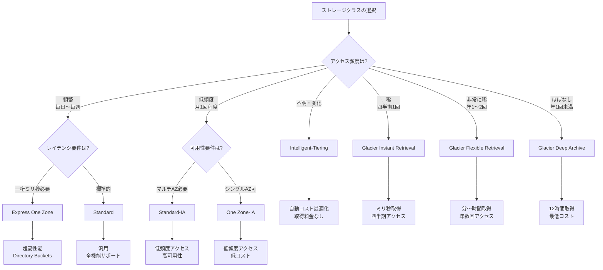

# Amazon S3 ストレージクラス比較

## 目次

- [概要](#概要)
- [ストレージクラス詳細](#ストレージクラス詳細)
  - [S3 Standard](#s3-standard)
  - [S3 Express One Zone](#s3-express-one-zone)
  - [S3 Intelligent-Tiering](#s3-intelligent-tiering)
  - [S3 Standard-IA](#s3-standard-ia)
  - [S3 One Zone-IA](#s3-one-zone-ia)
  - [S3 Glacier Instant Retrieval](#s3-glacier-instant-retrieval)
  - [S3 Glacier Flexible Retrieval](#s3-glacier-flexible-retrieval)
  - [S3 Glacier Deep Archive](#s3-glacier-deep-archive)
- [ストレージクラス比較表](#ストレージクラス比較表)
- [選択ガイド](#選択ガイド)
- [ライフサイクル管理](#ライフサイクル管理)
- [S3 Tablesとの関係](#s3-tablesとの関係)
- [ベストプラクティス](#ベストプラクティス)
- [出典](#出典)

---

## 概要

Amazon S3は、アクセスパターンとコスト要件に応じて最適化された8つのストレージクラスを提供しています。本ドキュメントでは、各ストレージクラスの特徴、料金、ユースケースを詳細に比較し、適切な選択をサポートします。

### 対象読者

- ストレージクラスの選択に悩んでいるエンジニア
- コスト最適化を検討しているアーキテクト
- S3ストレージクラス全体の理解を深めたい技術者

### 8つのストレージクラス

Amazon S3は、アクセス頻度に応じて以下の8つのストレージクラスを提供しています：

#### 頻繁なアクセス
1. **S3 Standard**: デフォルトのストレージクラス
2. **S3 Express One Zone**: 超低レイテンシ、高性能

#### 自動最適化
3. **S3 Intelligent-Tiering**: アクセスパターンに応じて自動移行

#### 低頻度アクセス
4. **S3 Standard-IA**: 低頻度アクセス、マルチAZ
5. **S3 One Zone-IA**: 低頻度アクセス、シングルAZ

#### アーカイブ
6. **S3 Glacier Instant Retrieval**: ミリ秒取得、四半期アクセス
7. **S3 Glacier Flexible Retrieval**: 分〜時間取得、年1-2回アクセス
8. **S3 Glacier Deep Archive**: 12時間取得、年1回未満アクセス

---

## ストレージクラス詳細

### S3 Standard

#### 概要

S3 Standard（`STANDARD`）は、Amazon S3のデフォルトストレージクラスです。頻繁にアクセスされるデータ向けに設計されており、高い耐久性、可用性、パフォーマンスを提供します。

#### 主要な特徴

| 特徴 | 詳細 |
|------|------|
| **耐久性** | 99.999999999%（11 9's） |
| **可用性** | 99.99% |
| **可用性SLA** | 99.9% |
| **アベイラビリティゾーン** | 最低3つのAZに分散 |
| **最小オブジェクトサイズ** | なし |
| **最小保存期間** | なし |
| **取得時間** | ミリ秒 |
| **取得料金** | なし |

#### ユースケース

- **頻繁にアクセスされるデータ**: Webサイト、モバイルアプリ、ゲームアプリケーション
- **コンテンツ配信**: CloudFrontと組み合わせた動画・画像配信
- **ビッグデータ分析**: Athena、EMR、Redshift Spectrumでの分析
- **データレイク**: 頻繁にクエリされるホットデータ

#### 料金（東京リージョン）

- **ストレージ**: $0.025/GB/月（最初の50TB）
- **PUT/POST/LIST**: $0.0047/1,000リクエスト
- **GET/その他**: $0.00037/1,000リクエスト

---

### S3 Express One Zone

#### 概要

S3 Express One Zone（`EXPRESS_ONEZONE`）は、一桁ミリ秒のレイテンシを提供する高性能ストレージクラスです。Directory Buckets専用で、最もレイテンシに敏感なアプリケーション向けに設計されています。

#### 主要な特徴

| 特徴 | 詳細 |
|------|------|
| **耐久性** | 99.999999999%（11 9's） |
| **可用性** | 99.95% |
| **可用性SLA** | 99.9% |
| **アベイラビリティゾーン** | 単一AZ内の複数デバイス |
| **最小オブジェクトサイズ** | なし |
| **最小保存期間** | なし |
| **取得時間** | 一桁ミリ秒 |
| **パフォーマンス** | S3 Standardの10倍高速 |

#### パフォーマンス特性

- **レイテンシ**: 一桁ミリ秒（single-digit millisecond）
- **スループット**: S3 Standardの最大10倍
- **リクエストコスト**: S3 Standardの50%低コスト
- **Read TPS**: バケットあたり最大200,000 TPS
- **Write TPS**: バケットあたり最大100,000 TPS

#### ユースケース

- **機械学習トレーニング**: 大量のトレーニングデータへの高速アクセス
- **リアルタイム分析**: ストリーミングデータの高速処理
- **金融取引**: 低レイテンシが要求される取引システム
- **メディア処理**: 動画エンコーディング、画像処理
- **ゲームアプリケーション**: プレイヤーデータへの高速アクセス

#### 制限事項

- Directory Buckets専用（General Purpose Bucketsでは使用不可）
- 単一AZ配置（AZ障害時のリスク）
- 一部のS3機能が非サポート（Versioning、Object Lock等）

#### 料金（東京リージョン）

- **ストレージ**: $0.16/GB/月
- **PUT/POST**: $0.0025/1,000リクエスト
- **GET**: $0.00008/1,000リクエスト

---

### S3 Intelligent-Tiering

#### 概要

S3 Intelligent-Tiering（`INTELLIGENT_TIERING`）は、アクセスパターンに応じて自動的にデータを最もコスト効率の良いアクセスティアに移動するストレージクラスです。アクセスパターンが不明または変化するデータに最適です。

#### 主要な特徴

| 特徴 | 詳細 |
|------|------|
| **耐久性** | 99.999999999%（11 9's） |
| **可用性** | 99.9% |
| **可用性SLA** | 99% |
| **アベイラビリティゾーン** | 最低3つのAZに分散 |
| **最小オブジェクトサイズ** | 128 KB（それ以下は常にFrequent Access） |
| **最小保存期間** | なし |
| **取得時間** | ミリ秒（Archive層は分〜時間） |
| **取得料金** | なし（Archive層を除く） |

#### 5つのアクセスティア

S3 Intelligent-Tieringは、以下の5つのアクセスティアを提供します：

1. **Frequent Access（頻繁なアクセス）**
   - 新規アップロードされたオブジェクトのデフォルトティア
   - S3 Standardと同じパフォーマンス

2. **Infrequent Access（低頻度アクセス）**
   - 30日間アクセスがないオブジェクトを自動移行
   - S3 Standard-IAと同じパフォーマンス

3. **Archive Instant Access（アーカイブ即時アクセス）**
   - 90日間アクセスがないオブジェクトを自動移行
   - ミリ秒アクセス、高スループット

4. **Archive Access（アーカイブアクセス）** - オプション
   - 90日間アクセスがないオブジェクトを移行（有効化時）
   - 分〜時間での取得
   - 非同期アクセス

5. **Deep Archive Access（ディープアーカイブアクセス）** - オプション
   - 180日間アクセスがないオブジェクトを移行（有効化時）
   - 12時間での取得
   - 非同期アクセス

#### モニタリング料金

- **オブジェクトモニタリング**: $0.0025/1,000オブジェクト/月
- **自動化料金**: なし（ティア間の移動は無料）

#### ユースケース

- **アクセスパターンが不明なデータ**: 新規プロジェクト、実験的なワークロード
- **変化するアクセスパターン**: 季節性のあるデータ、トレンドに応じたデータ
- **長期保存データ**: アクセス頻度が徐々に減少するデータ
- **コスト最適化**: 手動管理なしでストレージコストを削減

#### 料金（東京リージョン）

- **Frequent Access**: $0.025/GB/月
- **Infrequent Access**: $0.019/GB/月
- **Archive Instant Access**: $0.005/GB/月
- **Archive Access**: $0.0045/GB/月
- **Deep Archive Access**: $0.002/GB/月
- **モニタリング**: $0.0025/1,000オブジェクト/月

---

### S3 Standard-IA

#### 概要

S3 Standard-IA（`STANDARD_IA`、IA = Infrequent Access）は、低頻度でアクセスされるが、必要時には即座にアクセスが必要なデータ向けのストレージクラスです。

#### 主要な特徴

| 特徴 | 詳細 |
|------|------|
| **耐久性** | 99.999999999%（11 9's） |
| **可用性** | 99.9% |
| **可用性SLA** | 99% |
| **アベイラビリティゾーン** | 最低3つのAZに分散 |
| **最小オブジェクトサイズ** | 128 KB（それ以下は128 KBとして課金） |
| **最小保存期間** | 30日（早期削除は30日分課金） |
| **取得時間** | ミリ秒 |
| **取得料金** | あり（$0.01/GB） |

#### ユースケース

- **バックアップ**: 災害復旧用のバックアップデータ
- **古いデータ**: 月1回程度アクセスされるデータ
- **コンプライアンスデータ**: 規制要件で保持が必要だが、アクセスは稀
- **メディアアーカイブ**: 古い動画・画像ファイル

#### 料金（東京リージョン）

- **ストレージ**: $0.019/GB/月
- **PUT/POST/LIST**: $0.01/1,000リクエスト
- **GET/その他**: $0.001/1,000リクエスト
- **取得**: $0.01/GB

---

### S3 One Zone-IA

#### 概要

S3 One Zone-IA（`ONEZONE_IA`）は、単一のアベイラビリティゾーンにデータを保存する低頻度アクセス向けストレージクラスです。S3 Standard-IAより20%低コストですが、AZ障害時のリスクがあります。

#### 主要な特徴

| 特徴 | 詳細 |
|------|------|
| **耐久性** | 99.999999999%（11 9's、単一AZ内） |
| **可用性** | 99.5% |
| **可用性SLA** | 99% |
| **アベイラビリティゾーン** | 単一AZ |
| **最小オブジェクトサイズ** | 128 KB（それ以下は128 KBとして課金） |
| **最小保存期間** | 30日（早期削除は30日分課金） |
| **取得時間** | ミリ秒 |
| **取得料金** | あり（$0.01/GB） |

#### ユースケース

- **再作成可能なデータ**: サムネイル画像、トランスコード済み動画
- **セカンダリバックアップ**: 他のリージョンにプライマリバックアップがある場合
- **開発/テスト環境**: 本番環境ほどの可用性が不要なデータ

#### 制限事項

- AZ障害時にデータが失われるリスク
- S3 Replicationのソースとしては使用可能だが、デスティネーションとしては非推奨

#### 料金（東京リージョン）

- **ストレージ**: $0.0152/GB/月（S3 Standard-IAより20%低コスト）
- **PUT/POST/LIST**: $0.01/1,000リクエスト
- **GET/その他**: $0.001/1,000リクエスト
- **取得**: $0.01/GB

---

### S3 Glacier Instant Retrieval

#### 概要

S3 Glacier Instant Retrieval（`GLACIER_IR`）は、四半期に1回程度アクセスされるアーカイブデータ向けのストレージクラスです。ミリ秒でのアクセスを維持しながら、S3 Standard-IAより68%低コストです。

#### 主要な特徴

| 特徴 | 詳細 |
|------|------|
| **耐久性** | 99.999999999%（11 9's） |
| **可用性** | 99.9% |
| **可用性SLA** | 99% |
| **アベイラビリティゾーン** | 最低3つのAZに分散 |
| **最小オブジェクトサイズ** | 128 KB（それ以下は128 KBとして課金） |
| **最小保存期間** | 90日（早期削除は90日分課金） |
| **取得時間** | ミリ秒 |
| **取得料金** | あり（$0.03/GB） |

#### ユースケース

- **医療画像**: 四半期に1回程度参照される医療画像
- **ニュースメディアアーカイブ**: 古いニュース映像・記事
- **ユーザー生成コンテンツ**: 古いソーシャルメディア投稿
- **規制データ**: 長期保存が必要だが、アクセスは稀

#### 料金（東京リージョン）

- **ストレージ**: $0.005/GB/月（S3 Standard-IAより68%低コスト）
- **PUT/POST/LIST**: $0.02/1,000リクエスト
- **GET/その他**: $0.01/1,000リクエスト
- **取得**: $0.03/GB

---

### S3 Glacier Flexible Retrieval

#### 概要

S3 Glacier Flexible Retrieval（`GLACIER`、旧S3 Glacier）は、年に1〜2回アクセスされるアーカイブデータ向けのストレージクラスです。取得に数分〜数時間かかりますが、非常に低コストです。

#### 主要な特徴

| 特徴 | 詳細 |
|------|------|
| **耐久性** | 99.999999999%（11 9's） |
| **可用性** | 99.99%（復元後） |
| **可用性SLA** | 99.9% |
| **アベイラビリティゾーン** | 最低3つのAZに分散 |
| **最小オブジェクトサイズ** | 40 KB（それ以下は40 KBとして課金） |
| **最小保存期間** | 90日（早期削除は90日分課金） |
| **取得時間** | 1分〜12時間（取得オプションによる） |
| **取得料金** | あり（取得オプションによる） |

#### 取得オプション

1. **Expedited（高速）**: 1〜5分
   - 料金: $0.03/GB + $0.01/リクエスト
   - 緊急時の取得

2. **Standard（標準）**: 3〜5時間
   - 料金: $0.01/GB + $0.05/1,000リクエスト
   - 通常の取得

3. **Bulk（一括）**: 5〜12時間
   - 料金: $0.0025/GB + $0.025/1,000リクエスト
   - 大量データの低コスト取得

#### ユースケース

- **長期バックアップ**: 年に1〜2回復元するバックアップ
- **デジタル保存**: 歴史的記録、研究データ
- **規制アーカイブ**: 7年以上の保存が必要なデータ
- **メディアアーカイブ**: 古い映画、テレビ番組

#### 料金（東京リージョン）

- **ストレージ**: $0.0045/GB/月
- **PUT/POST/LIST**: $0.03/1,000リクエスト
- **取得**: 取得オプションによる

---

### S3 Glacier Deep Archive

#### 概要

S3 Glacier Deep Archive（`DEEP_ARCHIVE`）は、年に1回未満しかアクセスされないデータ向けの最も低コストなストレージクラスです。取得に12時間以上かかりますが、S3 Standardの1/25のコストです。

#### 主要な特徴

| 特徴 | 詳細 |
|------|------|
| **耐久性** | 99.999999999%（11 9's） |
| **可用性** | 99.99%（復元後） |
| **可用性SLA** | 99.9% |
| **アベイラビリティゾーン** | 最低3つのAZに分散 |
| **最小オブジェクトサイズ** | 40 KB（それ以下は40 KBとして課金） |
| **最小保存期間** | 180日（早期削除は180日分課金） |
| **取得時間** | 12〜48時間 |
| **取得料金** | あり（取得オプションによる） |

#### 取得オプション

1. **Standard（標準）**: 12時間以内
   - 料金: $0.02/GB + $0.10/1,000リクエスト

2. **Bulk（一括）**: 48時間以内
   - 料金: $0.0025/GB + $0.025/1,000リクエスト

#### ユースケース

- **規制アーカイブ**: 金融記録、医療記録（7〜10年保存）
- **デジタル保存**: 国立図書館、博物館のデジタルアーカイブ
- **災害復旧**: 最終手段のバックアップ
- **科学データ**: 長期保存が必要な研究データ

#### 料金（東京リージョン）

- **ストレージ**: $0.002/GB/月（S3 Standardの1/25）
- **PUT/POST/LIST**: $0.05/1,000リクエスト
- **取得**: 取得オプションによる

---
## ストレージクラス比較表

### 基本仕様比較

| ストレージクラス | 耐久性 | 可用性 | AZ | 最小サイズ | 最小期間 | 取得時間 |
|----------------|--------|--------|-----|-----------|---------|---------|
| **Standard** | 11 9's | 99.99% | ≥3 | なし | なし | ミリ秒 |
| **Express One Zone** | 11 9's | 99.95% | 1 | なし | なし | 一桁ミリ秒 |
| **Intelligent-Tiering** | 11 9's | 99.9% | ≥3 | 128 KB | なし | ミリ秒〜時間 |
| **Standard-IA** | 11 9's | 99.9% | ≥3 | 128 KB | 30日 | ミリ秒 |
| **One Zone-IA** | 11 9's | 99.5% | 1 | 128 KB | 30日 | ミリ秒 |
| **Glacier IR** | 11 9's | 99.9% | ≥3 | 128 KB | 90日 | ミリ秒 |
| **Glacier FR** | 11 9's | 99.99% | ≥3 | 40 KB | 90日 | 分〜時間 |
| **Glacier DA** | 11 9's | 99.99% | ≥3 | 40 KB | 180日 | 12〜48時間 |

### 料金比較（東京リージョン）

| ストレージクラス | ストレージ ($/GB/月) | PUT ($/1K req) | GET ($/1K req) | 取得 ($/GB) |
|----------------|----------------------|-------------------|-------------------|----------------|
| **Standard** | $0.025 | $0.0047 | $0.00037 | なし |
| **Express One Zone** | $0.16 | $0.0025 | $0.00008 | なし |
| **Intelligent-Tiering** | $0.025〜$0.002 | $0.0047 | $0.00037 | なし* |
| **Standard-IA** | $0.019 | $0.01 | $0.001 | $0.01 |
| **One Zone-IA** | $0.0152 | $0.01 | $0.001 | $0.01 |
| **Glacier IR** | $0.005 | $0.02 | $0.01 | $0.03 |
| **Glacier FR** | $0.0045 | $0.03 | - | $0.01〜$0.03 |
| **Glacier DA** | $0.002 | $0.05 | - | $0.0025〜$0.02 |

*Intelligent-TieringのArchive層は取得料金あり

### ユースケース比較

| ストレージクラス | 推奨ユースケース | アクセス頻度 |
|----------------|----------------|------------|
| **Standard** | Webサイト、モバイルアプリ、ビッグデータ分析 | 頻繁 |
| **Express One Zone** | 機械学習、リアルタイム分析、金融取引 | 頻繁（低レイテンシ） |
| **Intelligent-Tiering** | アクセスパターン不明、変化するデータ | 不明・変化 |
| **Standard-IA** | バックアップ、古いデータ、コンプライアンス | 月1回程度 |
| **One Zone-IA** | 再作成可能データ、セカンダリバックアップ | 月1回程度 |
| **Glacier IR** | 医療画像、ニュースアーカイブ、規制データ | 四半期1回 |
| **Glacier FR** | 長期バックアップ、デジタル保存、規制アーカイブ | 年1〜2回 |
| **Glacier DA** | 規制アーカイブ、デジタル保存、災害復旧 | 年1回未満 |

---

## 選択ガイド

### 選択フローチャート

### アクセスパターン別推奨

#### 頻繁なアクセス（毎日〜毎週）

**推奨**: S3 Standard または S3 Express One Zone

- **S3 Standard**: 汎用的なユースケース、全機能サポート
- **S3 Express One Zone**: 超低レイテンシが必要、機械学習、リアルタイム分析

#### アクセスパターンが不明または変化

**推奨**: S3 Intelligent-Tiering

- 自動的に最適なティアに移行
- 取得料金なし（Archive層を除く）
- 手動管理不要

#### 低頻度アクセス（月1回程度）

**推奨**: S3 Standard-IA または S3 One Zone-IA

- **S3 Standard-IA**: 高可用性が必要、重要なバックアップ
- **S3 One Zone-IA**: 再作成可能なデータ、20%低コスト

#### 四半期に1回程度のアクセス

**推奨**: S3 Glacier Instant Retrieval

- ミリ秒アクセスを維持
- S3 Standard-IAより68%低コスト
- 医療画像、ニュースアーカイブ

#### 年に1〜2回のアクセス

**推奨**: S3 Glacier Flexible Retrieval

- 取得に数分〜数時間
- 非常に低コスト
- 長期バックアップ、規制アーカイブ

#### 年に1回未満のアクセス

**推奨**: S3 Glacier Deep Archive

- 取得に12〜48時間
- 最も低コスト（S3 Standardの1/25）
- 規制アーカイブ、デジタル保存

---

## ライフサイクル管理

### ライフサイクルポリシーの基本

S3 Lifecycleを使用すると、オブジェクトのライフサイクル全体を自動管理できます。

#### 主要なアクション

1. **Transition（移行）**: オブジェクトを別のストレージクラスに移行
2. **Expiration（有効期限）**: オブジェクトを自動削除

#### 移行ルールの例

\`\`\`json
{
  "Rules": [
    {
      "Id": "ArchiveOldData",
      "Status": "Enabled",
      "Transitions": [
        {
          "Days": 30,
          "StorageClass": "STANDARD_IA"
        },
        {
          "Days": 90,
          "StorageClass": "GLACIER_IR"
        },
        {
          "Days": 365,
          "StorageClass": "GLACIER"
        }
      ],
      "Expiration": {
        "Days": 2555
      }
    }
  ]
}
\`\`\`

### 移行パス

#### サポートされる移行パス

\`\`\`
Standard
  ↓
Standard-IA / Intelligent-Tiering
  ↓
One Zone-IA
  ↓
Glacier Instant Retrieval
  ↓
Glacier Flexible Retrieval
  ↓
Glacier Deep Archive
\`\`\`

#### 移行の制約

- **最小保存期間**: 移行前に最小保存期間を満たす必要がある
- **最小オブジェクトサイズ**: 各ストレージクラスの最小サイズ要件を満たす必要がある
- **逆方向の移行**: 手動でのみ可能（Lifecycleでは不可）

### ベストプラクティス

1. **段階的な移行**
   - 30日後: Standard → Standard-IA
   - 90日後: Standard-IA → Glacier IR
   - 365日後: Glacier IR → Glacier FR

2. **コスト最適化**
   - Storage Class Analysisで実際のアクセスパターンを分析
   - 適切な移行タイミングを決定

3. **有効期限の設定**
   - 不要になったデータは自動削除
   - ストレージコストを削減

---

## S3 Tablesとの関係

### Table Bucketsで使用可能なストレージクラス

Table Bucketsは、以下のストレージクラスをサポートします：

| ストレージクラス | サポート状況 | 備考 |
|----------------|------------|------|
| **Standard** | ✅ サポート | デフォルト |
| **Express One Zone** | ❌ 非サポート | Directory Buckets専用 |
| **Intelligent-Tiering** | ✅ サポート | 推奨 |
| **Standard-IA** | ✅ サポート | 低頻度アクセス |
| **One Zone-IA** | ✅ サポート | 低コスト |
| **Glacier IR** | ✅ サポート | アーカイブ |
| **Glacier FR** | ✅ サポート | 長期アーカイブ |
| **Glacier DA** | ✅ サポート | 最長期アーカイブ |

### 推奨ストレージクラス

#### 分析ワークロード（頻繁なクエリ）

**推奨**: S3 Standard

- Athena、EMR、Redshiftからの頻繁なクエリ
- 低レイテンシアクセスが必要

#### アクセスパターンが不明

**推奨**: S3 Intelligent-Tiering

- 新規プロジェクト、実験的なワークロード
- 自動コスト最適化

#### 低頻度アクセスの分析データ

**推奨**: S3 Standard-IA

- 月1回程度のクエリ
- コスト削減

#### アーカイブデータ

**推奨**: S3 Glacier Instant Retrieval

- 四半期に1回程度のクエリ
- ミリ秒アクセスを維持

### ライフサイクル管理の考慮事項

Table Bucketsでは、以下の点に注意してライフサイクルポリシーを設定します：

1. **メタデータファイル**: Icebergメタデータファイルは頻繁にアクセスされるため、Standardに維持
2. **データファイル**: アクセス頻度に応じて移行
3. **スナップショット**: 古いスナップショットは自動削除される

---

## ベストプラクティス

### コスト最適化

1. **Storage Class Analysisの活用**
   - 実際のアクセスパターンを分析
   - 適切なストレージクラスを選択

2. **Intelligent-Tieringの活用**
   - アクセスパターンが不明な場合
   - 手動管理のオーバーヘッドを削減

3. **Lifecycleポリシーの設定**
   - 段階的な移行ルールを設定
   - 不要なデータは自動削除

4. **最小保存期間の考慮**
   - 早期削除による追加料金を回避
   - 適切な移行タイミングを設定

### パフォーマンス最適化

1. **頻繁にアクセスされるデータ**
   - S3 Standardに配置
   - 必要に応じてCloudFrontと組み合わせ

2. **低レイテンシが必要**
   - S3 Express One Zoneを使用
   - コンピュートリソースと同じAZに配置

3. **取得時間の考慮**
   - Glacier系ストレージクラスは取得に時間がかかる
   - 緊急時のアクセスが必要な場合は避ける

### セキュリティ

1. **暗号化の有効化**
   - SSE-S3（デフォルト）またはSSE-KMS
   - 全てのストレージクラスで利用可能

2. **アクセス制御**
   - IAMポリシー、Bucket Policiesで最小権限の原則
   - Block Public Accessを有効化

3. **監査ログ**
   - CloudTrailでAPI呼び出しを記録
   - Server Access Loggingでアクセスログを記録

### 運用管理

1. **タグの活用**
   - コスト配分タグでコスト管理
   - ライフサイクルルールでタグベースの移行

2. **モニタリング**
   - CloudWatchメトリクスで使用状況を監視
   - Storage Lensで組織全体のストレージを分析

3. **定期的な見直し**
   - アクセスパターンの変化を確認
   - ストレージクラスの最適化

---

## 出典

本ドキュメントは、以下のAWS公式ドキュメントに基づいて作成されています：

1. **Understanding and managing Amazon S3 storage classes**
   - URL: https://docs.aws.amazon.com/AmazonS3/latest/userguide/storage-class-intro.html
   - アクセス日: 2025-11-16

2. **How S3 Intelligent-Tiering works**
   - URL: https://docs.aws.amazon.com/AmazonS3/latest/userguide/intelligent-tiering-overview.html
   - アクセス日: 2025-11-16

3. **Understanding S3 Glacier storage classes for long-term data storage**
   - URL: https://docs.aws.amazon.com/AmazonS3/latest/userguide/glacier-storage-classes.html
   - アクセス日: 2025-11-16

4. **Managing the lifecycle of objects**
   - URL: https://docs.aws.amazon.com/AmazonS3/latest/userguide/object-lifecycle-mgmt.html
   - アクセス日: 2025-11-16

5. **Transitioning objects using Amazon S3 Lifecycle**
   - URL: https://docs.aws.amazon.com/AmazonS3/latest/userguide/lifecycle-transition-general-considerations.html
   - アクセス日: 2025-11-16

6. **Amazon S3 pricing**
   - URL: https://aws.amazon.com/s3/pricing/
   - アクセス日: 2025-11-16

---

**最終更新**: 2025-11-16  
**ドキュメントバージョン**: 1.0  
**確実性**: 高（AWS公式ドキュメントに基づく）
