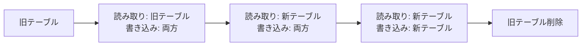

# 既存データレイクからの移行


## 目次

- [概要](#概要)
  - [移行の利点](#移行の利点)
  - [対象となるデータレイク](#対象となるデータレイク)
- [移行戦略](#移行戦略)
  - [移行方法の比較](#移行方法の比較)
  - [Full Data Migrationの特徴](#full-data-migrationの特徴)
    - [利点](#利点)
    - [欠点](#欠点)
  - [移行戦略の選択基準](#移行戦略の選択基準)
- [Full Data Migration実装](#full-data-migration実装)
  - [方法1: CREATE TABLE AS SELECT (CTAS)](#方法1-create-table-as-select-ctas)
    - [Athenaを使用したCTAS](#athenaを使用したctas)
    - [Sparkを使用したCTAS（EMR/Glue）](#sparkを使用したctasemrglue)
  - [方法2: CREATE TABLE + INSERT](#方法2-create-table-insert)
    - [ステップ1: テーブル作成](#ステップ1-テーブル作成)
    - [ステップ2: データ挿入](#ステップ2-データ挿入)
    - [ステップ3: パーティション単位での段階的移行](#ステップ3-パーティション単位での段階的移行)
  - [方法3: Sparkを使用したプログラマティック移行](#方法3-sparkを使用したプログラマティック移行)
  - [方法4: AWS Glueを使用した移行](#方法4-aws-glueを使用した移行)
- [移行手順](#移行手順)
  - [フェーズ1: 計画と準備](#フェーズ1-計画と準備)
    - [1.1 現状分析](#11-現状分析)
    - [1.2 移行計画の策定](#12-移行計画の策定)
    - [1.3 リソース計画](#13-リソース計画)
  - [フェーズ2: テスト移行](#フェーズ2-テスト移行)
    - [2.1 テスト環境の構築](#21-テスト環境の構築)
    - [2.2 小規模テーブルでのテスト](#22-小規模テーブルでのテスト)
    - [2.3 パフォーマンステスト](#23-パフォーマンステスト)
  - [フェーズ3: 本番移行](#フェーズ3-本番移行)
    - [3.1 段階的移行戦略](#31-段階的移行戦略)
    - [3.2 並列移行](#32-並列移行)
    - [3.3 データ検証](#33-データ検証)
  - [フェーズ4: カットオーバー](#フェーズ4-カットオーバー)
    - [4.1 ハイブリッド運用期間](#41-ハイブリッド運用期間)
    - [4.2 アプリケーションの更新](#42-アプリケーションの更新)
    - [4.3 旧テーブルの削除](#43-旧テーブルの削除)
- [ダウンタイム最小化](#ダウンタイム最小化)
  - [ゼロダウンタイム移行戦略](#ゼロダウンタイム移行戦略)
    - [1. 読み取り/書き込みの分離](#1-読み取り書き込みの分離)
    - [2. Change Data Capture (CDC)](#2-change-data-capture-cdc)
    - [3. 段階的カットオーバー](#3-段階的カットオーバー)
- [移行ツール](#移行ツール)
  - [AWS Glue](#aws-glue)
    - [Glue ETL Jobを使用した移行](#glue-etl-jobを使用した移行)
  - [Amazon EMR](#amazon-emr)
    - [EMR Sparkジョブを使用した移行](#emr-sparkジョブを使用した移行)
  - [カスタムスクリプト](#カスタムスクリプト)
    - [Pythonスクリプトを使用した移行](#pythonスクリプトを使用した移行)
- [ベストプラクティス](#ベストプラクティス)
  - [1. 移行前の準備](#1-移行前の準備)
  - [2. データ品質の向上](#2-データ品質の向上)
  - [3. パーティション戦略の最適化](#3-パーティション戦略の最適化)
  - [4. ファイルサイズの最適化](#4-ファイルサイズの最適化)
  - [5. 圧縮設定](#5-圧縮設定)
  - [6. モニタリングとアラート](#6-モニタリングとアラート)
  - [7. ロールバック計画](#7-ロールバック計画)
- [トラブルシューティング](#トラブルシューティング)
  - [一般的な問題と解決方法](#一般的な問題と解決方法)
    - [問題1: メモリ不足エラー](#問題1-メモリ不足エラー)
    - [問題2: スキーマ不一致](#問題2-スキーマ不一致)
    - [問題3: パーティション数が多すぎる](#問題3-パーティション数が多すぎる)
    - [問題4: 移行が遅い](#問題4-移行が遅い)
- [出典](#出典)
  - [AWS公式ドキュメント](#aws公式ドキュメント)
  - [関連リソース](#関連リソース)

## 概要

既存のHive形式のデータレイクからAmazon S3 Tablesへの移行は、データ品質の向上、クエリパフォーマンスの改善、運用コストの削減を実現する重要なステップです。このドキュメントでは、移行戦略、実装手順、ベストプラクティスについて説明します。

### 移行の利点

- **パフォーマンス向上**: 最適化されたデータレイアウトとメタデータ管理
- **運用の簡素化**: 自動メンテナンス機能（コンパクション、スナップショット管理）
- **コスト削減**: ストレージ最適化とクエリ効率の向上
- **スキーマ進化**: 柔軟なスキーマ変更とバージョン管理
- **タイムトラベル**: 過去のデータ状態へのアクセス
- **ACID保証**: トランザクションの一貫性と信頼性

### 対象となるデータレイク

このガイドは、以下の形式のHive形式テーブルからの移行に適用されます：

- **Apache Parquet**
- **Apache ORC**
- **Apache Avro**
- **CSV**
- **JSON**

**注意**: Delta LakeやApache Hudiなどの最新のテーブルフォーマットからの移行には適用されません。

## 移行戦略

### 移行方法の比較

Amazon S3 Tablesへの移行には、以下の方法があります：

| 移行方法 | 説明 | S3 Tablesサポート | 推奨度 |
|---------|------|------------------|-------|
| **In-place Migration (snapshot)** | 既存データファイルの上にIcebergメタデータを生成 | ❌ 非サポート | - |
| **In-place Migration (migrate)** | テーブルを置き換え、既存データファイルを再利用 | ❌ 非サポート | - |
| **Full Data Migration** | データファイルとメタデータを完全に再作成 | ✅ サポート | ⭐⭐⭐ |

**重要**: Amazon S3 Tablesへの移行には、**Full Data Migration**のみが使用できます。In-place Migrationは、S3 Tablesへの移行には対応していません。

### Full Data Migrationの特徴

#### 利点

- **データレイアウトの最適化**: データの再ソート、パーティション戦略の変更、ファイルサイズの最適化
- **スキーマの変更**: カラムの追加、削除、データ型の変更
- **データ検証**: 移行前のデータ整合性チェック
- **フォーマット変換**: CSV/JSONからParquetへの変換
- **Hidden Partitioning**: Icebergの高度なパーティショニング機能の活用
- **ソート順の最適化**: クエリパターンに基づくデータソート
- **S3 Tablesサポート**: S3 Tablesへの移行が可能

#### 欠点

- **時間**: データの完全な書き直しが必要
- **コスト**: コンピューティングリソースとストレージコストが高い
- **リソース**: 大規模なデータセットでは大量のリソースが必要

### 移行戦略の選択基準

以下の質問に基づいて、最適な移行戦略を選択します：

| 質問 | 推奨事項 |
|------|---------|
| **データファイル形式は何ですか？** | • Parquet、ORC、Avro: In-place migration可能（ただしS3 Tables以外）<br>• CSV、JSON: Full data migration必須 |
| **テーブルスキーマを更新または統合したいですか？** | • スキーマ進化のみ: In-place migration可能<br>• カラムの削除: Full data migration推奨 |
| **パーティション戦略を変更したいですか？** | • Hidden partitioningを使用: Full data migration必須<br>• 既存パーティション維持: In-place migration可能 |
| **ソート順を追加または変更したいですか？** | • ソート順変更: Full data migration必須<br>• 頻繁にアクセスされるパーティションのみ: In-place + コンパクション |
| **テーブルに多数の小ファイルがありますか？** | • 小ファイル統合: Full data migration推奨<br>• 大規模テーブル: In-place + コンパクション |
| **S3 Tablesに移行しますか？** | • S3 Tables: Full data migration必須 |

## Full Data Migration実装

### 方法1: CREATE TABLE AS SELECT (CTAS)

#### Athenaを使用したCTAS

```sql
-- S3 Tablesへの移行
CREATE TABLE s3tablescatalog.my_namespace.orders_iceberg
WITH (
  table_type = 'ICEBERG',
  format = 'PARQUET',
  location = 's3://my-table-bucket/my-namespace/orders_iceberg/',
  is_external = false,
  partitioning = ARRAY['bucket(customer_id, 16)', 'year(order_date)']
)
AS
SELECT 
  order_id,
  customer_id,
  order_date,
  amount,
  status
FROM legacy_db.orders
WHERE order_date >= DATE '2020-01-01';
```

#### Sparkを使用したCTAS（EMR/Glue）

```python
from pyspark.sql import SparkSession

# Spark設定
spark = SparkSession.builder \
    .appName("S3TablesMigration") \
    .config("spark.sql.extensions", "org.apache.iceberg.spark.extensions.IcebergSparkSessionExtensions") \
    .config("spark.sql.catalog.s3tablescatalog", "software.amazon.s3tables.iceberg.S3TablesCatalog") \
    .config("spark.sql.catalog.s3tablescatalog.warehouse", "arn:aws:s3tables:us-east-1:111122223333:bucket/my-table-bucket") \
    .getOrCreate()

# CTASでテーブル作成
spark.sql("""
CREATE TABLE s3tablescatalog.my_namespace.orders_iceberg
USING iceberg
PARTITIONED BY (bucket(16, customer_id), years(order_date))
TBLPROPERTIES (
  'write.format.default' = 'parquet',
  'write.parquet.compression-codec' = 'zstd',
  'write.target-file-size-bytes' = '536870912'
)
AS
SELECT
  order_id,
  customer_id,
  order_date,
  amount,
  status
FROM legacy_db.orders
WHERE order_date >= DATE '2020-01-01'
""")
```

### 方法2: CREATE TABLE + INSERT

#### ステップ1: テーブル作成

```sql
-- Athenaでテーブル作成
CREATE TABLE s3tablescatalog.my_namespace.orders_iceberg (
  order_id BIGINT,
  customer_id BIGINT,
  order_date DATE,
  amount DECIMAL(10,2),
  status STRING
)
PARTITIONED BY (bucket(customer_id, 16), year(order_date))
LOCATION 's3://my-table-bucket/my-namespace/orders_iceberg/'
TBLPROPERTIES (
  'table_type' = 'ICEBERG',
  'format' = 'PARQUET',
  'write_compression' = 'zstd'
);
```

#### ステップ2: データ挿入

```sql
-- 全データの挿入
INSERT INTO s3tablescatalog.my_namespace.orders_iceberg
SELECT
  order_id,
  customer_id,
  order_date,
  amount,
  status
FROM legacy_db.orders;
```

#### ステップ3: パーティション単位での段階的移行

```sql
-- 年単位での段階的移行
INSERT INTO s3tablescatalog.my_namespace.orders_iceberg
SELECT 
  order_id,
  customer_id,
  order_date,
  amount,
  status
FROM legacy_db.orders
WHERE YEAR(order_date) = 2020;

-- 次の年を移行
INSERT INTO s3tablescatalog.my_namespace.orders_iceberg
SELECT 
  order_id,
  customer_id,
  order_date,
  amount,
  status
FROM legacy_db.orders
WHERE YEAR(order_date) = 2021;
```

### 方法3: Sparkを使用したプログラマティック移行

```python
from pyspark.sql import SparkSession
from pyspark.sql.functions import col, year, month

# Spark設定
spark = SparkSession.builder \
    .appName("S3TablesMigration") \
    .config("spark.sql.extensions", "org.apache.iceberg.spark.extensions.IcebergSparkSessionExtensions") \
    .config("spark.sql.catalog.s3tablescatalog", "software.amazon.s3tables.iceberg.S3TablesCatalog") \
    .config("spark.sql.catalog.s3tablescatalog.warehouse", "arn:aws:s3tables:us-east-1:111122223333:bucket/my-table-bucket") \
    .getOrCreate()

# ソーステーブルの読み込み
source_df = spark.table("legacy_db.orders")

# データ変換とクレンジング
transformed_df = source_df \
    .filter(col("order_date") >= "2020-01-01") \
    .withColumn("year", year(col("order_date"))) \
    .withColumn("month", month(col("order_date"))) \
    .select(
        "order_id",
        "customer_id",
        "order_date",
        "amount",
        "status",
        "year",
        "month"
    )

# S3 Tablesへの書き込み
transformed_df.writeTo("s3tablescatalog.my_namespace.orders_iceberg") \
    .using("iceberg") \
    .partitionedBy("bucket(16, customer_id)", "year", "month") \
    .tableProperty("write.format.default", "parquet") \
    .tableProperty("write.parquet.compression-codec", "zstd") \
    .tableProperty("write.target-file-size-bytes", "536870912") \
    .create()
```

### 方法4: AWS Glueを使用した移行

```python
import sys
from awsglue.transforms import *
from awsglue.utils import getResolvedOptions
from pyspark.context import SparkContext
from awsglue.context import GlueContext
from awsglue.job import Job

# Glue Job初期化
args = getResolvedOptions(sys.argv, ['JOB_NAME'])
sc = SparkContext()
glueContext = GlueContext(sc)
spark = glueContext.spark_session
job = Job(glueContext)
job.init(args['JOB_NAME'], args)

# Iceberg設定
spark.conf.set("spark.sql.extensions", "org.apache.iceberg.spark.extensions.IcebergSparkSessionExtensions")
spark.conf.set("spark.sql.catalog.s3tablescatalog", "software.amazon.s3tables.iceberg.S3TablesCatalog")
spark.conf.set("spark.sql.catalog.s3tablescatalog.warehouse", "arn:aws:s3tables:us-east-1:111122223333:bucket/my-table-bucket")

# ソースデータの読み込み
source_dyf = glueContext.create_dynamic_frame.from_catalog(
    database="legacy_db",
    table_name="orders"
)

# DataFrameに変換
source_df = source_dyf.toDF()

# データ変換
transformed_df = source_df.filter(col("order_date") >= "2020-01-01")

# S3 Tablesへの書き込み
transformed_df.writeTo("s3tablescatalog.my_namespace.orders_iceberg") \
    .using("iceberg") \
    .partitionedBy("bucket(16, customer_id)", "years(order_date)") \
    .tableProperty("write.format.default", "parquet") \
    .tableProperty("write.parquet.compression-codec", "zstd") \
    .create()

job.commit()
```


## 移行手順

### フェーズ1: 計画と準備

#### 1.1 現状分析

```sql
-- テーブルサイズの確認
SELECT
  table_name,
  COUNT(*) as row_count,
  SUM(file_size) / 1024 / 1024 / 1024 as size_gb,
  COUNT(DISTINCT partition_key) as partition_count
FROM information_schema.partitions
WHERE table_schema = 'legacy_db'
GROUP BY table_name;

-- ファイル数の確認
SELECT
  table_name,
  COUNT(*) as file_count,
  AVG(file_size) / 1024 / 1024 as avg_file_size_mb,
  MIN(file_size) / 1024 / 1024 as min_file_size_mb,
  MAX(file_size) / 1024 / 1024 as max_file_size_mb
FROM table_files
WHERE database_name = 'legacy_db'
GROUP BY table_name;
```

#### 1.2 移行計画の策定

**移行対象の優先順位付け**:

1. **高優先度**: 頻繁にアクセスされるテーブル、パフォーマンス問題のあるテーブル
2. **中優先度**: 定期的にアクセスされるテーブル
3. **低優先度**: アーカイブデータ、アクセス頻度の低いテーブル

**移行スケジュール**:

| フェーズ | 期間 | 内容 |
|---------|------|------|
| 準備 | 1-2週間 | 現状分析、計画策定、テスト環境構築 |
| パイロット | 1-2週間 | 小規模テーブルでの移行テスト |
| 段階的移行 | 4-8週間 | 優先度順に段階的に移行 |
| 検証 | 1-2週間 | データ整合性確認、パフォーマンステスト |
| カットオーバー | 1週間 | 本番環境への切り替え |

#### 1.3 リソース計画

**コンピューティングリソース**:

| テーブルサイズ | 推奨リソース | 推定時間 |
|--------------|------------|---------|
| < 100 GB | EMR: m5.xlarge × 2 | 1-2時間 |
| 100 GB - 1 TB | EMR: m5.2xlarge × 4 | 4-8時間 |
| 1 TB - 10 TB | EMR: m5.4xlarge × 8 | 1-2日 |
| > 10 TB | EMR: m5.8xlarge × 16 | 3-7日 |

**ストレージコスト**:

- 移行期間中は、ソースデータとターゲットデータの両方が存在
- 移行完了後、ソースデータを削除するまでの期間を考慮

### フェーズ2: テスト移行

#### 2.1 テスト環境の構築

```bash
# Table Bucketの作成
aws s3tables create-table-bucket \
  --name test-migration-bucket \
  --region us-east-1

# Namespaceの作成
aws s3tables create-namespace \
  --table-bucket-arn arn:aws:s3tables:us-east-1:111122223333:bucket/test-migration-bucket \
  --namespace test_namespace
```

#### 2.2 小規模テーブルでのテスト

```sql
-- テストテーブルの作成（1ヶ月分のデータ）
CREATE TABLE s3tablescatalog.test_namespace.orders_test
USING iceberg
PARTITIONED BY (bucket(16, customer_id), year(order_date), month(order_date))
AS
SELECT *
FROM legacy_db.orders
WHERE order_date BETWEEN DATE '2024-01-01' AND DATE '2024-01-31';

-- データ整合性の確認
SELECT
  COUNT(*) as row_count,
  SUM(amount) as total_amount,
  MIN(order_date) as min_date,
  MAX(order_date) as max_date
FROM s3tablescatalog.test_namespace.orders_test;

-- ソーステーブルとの比較
SELECT
  'source' as table_type,
  COUNT(*) as row_count,
  SUM(amount) as total_amount
FROM legacy_db.orders
WHERE order_date BETWEEN DATE '2024-01-01' AND DATE '2024-01-31'
UNION ALL
SELECT
  'target' as table_type,
  COUNT(*) as row_count,
  SUM(amount) as total_amount
FROM s3tablescatalog.test_namespace.orders_test;
```

#### 2.3 パフォーマンステスト

```sql
-- クエリパフォーマンスの比較
-- ソーステーブル
SELECT customer_id, COUNT(*), SUM(amount)
FROM legacy_db.orders
WHERE order_date BETWEEN DATE '2024-01-01' AND DATE '2024-01-31'
GROUP BY customer_id;

-- ターゲットテーブル
SELECT customer_id, COUNT(*), SUM(amount)
FROM s3tablescatalog.test_namespace.orders_test
WHERE order_date BETWEEN DATE '2024-01-01' AND DATE '2024-01-31'
GROUP BY customer_id;
```

### フェーズ3: 本番移行

#### 3.1 段階的移行戦略

**オプション1: パーティション単位での移行**

```python
from datetime import datetime, timedelta
from pyspark.sql import SparkSession

spark = SparkSession.builder \
    .appName("PartitionMigration") \
    .config("spark.sql.extensions", "org.apache.iceberg.spark.extensions.IcebergSparkSessionExtensions") \
    .config("spark.sql.catalog.s3tablescatalog", "software.amazon.s3tables.iceberg.S3TablesCatalog") \
    .config("spark.sql.catalog.s3tablescatalog.warehouse", "arn:aws:s3tables:us-east-1:111122223333:bucket/my-table-bucket") \
    .getOrCreate()

# 年単位での移行
years = [2020, 2021, 2022, 2023, 2024]

for year in years:
    print(f"Migrating data for year {year}...")

    spark.sql(f"""
    INSERT INTO s3tablescatalog.my_namespace.orders_iceberg
    SELECT *
    FROM legacy_db.orders
    WHERE YEAR(order_date) = {year}
    """)

    print(f"Year {year} migration completed.")
```

**オプション2: 時間ウィンドウでの移行**

```python
from datetime import datetime, timedelta

# 1ヶ月単位での移行
start_date = datetime(2020, 1, 1)
end_date = datetime(2024, 12, 31)
current_date = start_date

while current_date <= end_date:
    next_date = current_date + timedelta(days=30)
    
    print(f"Migrating data from {current_date} to {next_date}...")
    
    spark.sql(f"""
    INSERT INTO s3tablescatalog.my_namespace.orders_iceberg
    SELECT *
    FROM legacy_db.orders
    WHERE order_date >= DATE '{current_date.strftime('%Y-%m-%d')}'
      AND order_date < DATE '{next_date.strftime('%Y-%m-%d')}'
    """)
    
    current_date = next_date
    print(f"Migration completed for {current_date}.")
```

#### 3.2 並列移行

```python
from concurrent.futures import ThreadPoolExecutor
from pyspark.sql import SparkSession

def migrate_partition(year, month):
    """パーティション単位での移行"""
    spark = SparkSession.builder \
        .appName(f"Migration-{year}-{month}") \
        .config("spark.sql.extensions", "org.apache.iceberg.spark.extensions.IcebergSparkSessionExtensions") \
        .config("spark.sql.catalog.s3tablescatalog", "software.amazon.s3tables.iceberg.S3TablesCatalog") \
        .config("spark.sql.catalog.s3tablescatalog.warehouse", "arn:aws:s3tables:us-east-1:111122223333:bucket/my-table-bucket") \
        .getOrCreate()

    try:
        spark.sql(f"""
        INSERT INTO s3tablescatalog.my_namespace.orders_iceberg
        SELECT *
        FROM legacy_db.orders
        WHERE YEAR(order_date) = {year}
          AND MONTH(order_date) = {month}
        """)
        print(f"Successfully migrated {year}-{month}")
        return True
    except Exception as e:
        print(f"Failed to migrate {year}-{month}: {str(e)}")
        return False

# 並列実行
partitions = [(year, month) for year in range(2020, 2025) for month in range(1, 13)]

with ThreadPoolExecutor(max_workers=4) as executor:
    results = executor.map(lambda p: migrate_partition(p[0], p[1]), partitions)

    success_count = sum(results)
    print(f"Migration completed: {success_count}/{len(partitions)} partitions successful")
```

#### 3.3 データ検証

```sql
-- 行数の比較
SELECT 
  'source' as table_type,
  COUNT(*) as row_count
FROM legacy_db.orders
UNION ALL
SELECT 
  'target' as table_type,
  COUNT(*) as row_count
FROM s3tablescatalog.my_namespace.orders_iceberg;

-- 集計値の比較
SELECT 
  'source' as table_type,
  SUM(amount) as total_amount,
  AVG(amount) as avg_amount,
  MIN(order_date) as min_date,
  MAX(order_date) as max_date
FROM legacy_db.orders
UNION ALL
SELECT 
  'target' as table_type,
  SUM(amount) as total_amount,
  AVG(amount) as avg_amount,
  MIN(order_date) as min_date,
  MAX(order_date) as max_date
FROM s3tablescatalog.my_namespace.orders_iceberg;

-- パーティション単位での検証
SELECT 
  YEAR(order_date) as year,
  MONTH(order_date) as month,
  COUNT(*) as source_count
FROM legacy_db.orders
GROUP BY YEAR(order_date), MONTH(order_date)
EXCEPT
SELECT 
  YEAR(order_date) as year,
  MONTH(order_date) as month,
  COUNT(*) as target_count
FROM s3tablescatalog.my_namespace.orders_iceberg
GROUP BY YEAR(order_date), MONTH(order_date);
```

### フェーズ4: カットオーバー

#### 4.1 ハイブリッド運用期間

移行完了後、一定期間は両方のテーブルを並行運用します：

```sql
-- ビューを使用した透過的なアクセス
CREATE OR REPLACE VIEW analytics.orders AS
SELECT * FROM s3tablescatalog.my_namespace.orders_iceberg;

-- アプリケーションは既存のビュー名でアクセス可能
SELECT * FROM analytics.orders WHERE order_date >= CURRENT_DATE - INTERVAL '7' DAY;
```

#### 4.2 アプリケーションの更新

**段階的な切り替え**:

1. **読み取り専用アプリケーション**: 新しいテーブルに切り替え
2. **バッチ処理**: 新しいテーブルに切り替え
3. **リアルタイム処理**: 最後に切り替え

```python
# 設定ファイルでの切り替え
config = {
    "source_table": "s3tablescatalog.my_namespace.orders_iceberg",  # 新しいテーブル
    "legacy_table": "legacy_db.orders",  # 旧テーブル（バックアップ）
    "use_legacy": False  # Falseで新しいテーブルを使用
}

# アプリケーションコード
table_name = config["legacy_table"] if config["use_legacy"] else config["source_table"]
df = spark.table(table_name)
```

#### 4.3 旧テーブルの削除

```sql
-- バックアップの作成（オプション）
CREATE TABLE legacy_db.orders_backup AS
SELECT * FROM legacy_db.orders;

-- 旧テーブルの削除
DROP TABLE legacy_db.orders;

-- S3データの削除（注意: 不可逆的な操作）
-- aws s3 rm s3://legacy-bucket/orders/ --recursive
```

## ダウンタイム最小化

### ゼロダウンタイム移行戦略

#### 1. 読み取り/書き込みの分離

```sql
-- 読み取りは新しいテーブルから
SELECT * FROM s3tablescatalog.my_namespace.orders_iceberg;

-- 書き込みは両方のテーブルに（移行期間中）
INSERT INTO legacy_db.orders VALUES (...);
INSERT INTO s3tablescatalog.my_namespace.orders_iceberg VALUES (...);
```

#### 2. Change Data Capture (CDC)

```python
from pyspark.sql import SparkSession
from pyspark.sql.functions import col, current_timestamp

spark = SparkSession.builder \
    .appName("CDCMigration") \
    .getOrCreate()

# 最終移行タイムスタンプ
last_migration_ts = "2024-01-15 00:00:00"

# 差分データの移行
incremental_df = spark.sql(f"""
SELECT *
FROM legacy_db.orders
WHERE updated_at > TIMESTAMP '{last_migration_ts}'
""")

# S3 Tablesへの書き込み（MERGE操作）
incremental_df.createOrReplaceTempView("incremental_data")

spark.sql("""
MERGE INTO s3tablescatalog.my_namespace.orders_iceberg AS target
USING incremental_data AS source
ON target.order_id = source.order_id
WHEN MATCHED THEN UPDATE SET *
WHEN NOT MATCHED THEN INSERT *
""")
```

#### 3. 段階的カットオーバー




## 移行ツール

### AWS Glue

#### Glue ETL Jobを使用した移行

```python
import sys
from awsglue.transforms import *
from awsglue.utils import getResolvedOptions
from pyspark.context import SparkContext
from awsglue.context import GlueContext
from awsglue.job import Job
from pyspark.sql.functions import col, year, month

args = getResolvedOptions(sys.argv, ['JOB_NAME', 'SOURCE_DATABASE', 'SOURCE_TABLE', 'TARGET_NAMESPACE', 'TARGET_TABLE'])

sc = SparkContext()
glueContext = GlueContext(sc)
spark = glueContext.spark_session
job = Job(glueContext)
job.init(args['JOB_NAME'], args)

# Iceberg設定
spark.conf.set("spark.sql.extensions", "org.apache.iceberg.spark.extensions.IcebergSparkSessionExtensions")
spark.conf.set("spark.sql.catalog.s3tablescatalog", "software.amazon.s3tables.iceberg.S3TablesCatalog")
spark.conf.set("spark.sql.catalog.s3tablescatalog.warehouse", "arn:aws:s3tables:us-east-1:111122223333:bucket/my-table-bucket")

# ソースデータの読み込み
source_dyf = glueContext.create_dynamic_frame.from_catalog(
    database=args['SOURCE_DATABASE'],
    table_name=args['SOURCE_TABLE']
)

# DataFrameに変換
source_df = source_dyf.toDF()

# データ変換とクレンジング
transformed_df = source_df \
    .filter(col("order_date").isNotNull()) \
    .withColumn("year", year(col("order_date"))) \
    .withColumn("month", month(col("order_date")))

# S3 Tablesへの書き込み
transformed_df.writeTo(f"s3tablescatalog.{args['TARGET_NAMESPACE']}.{args['TARGET_TABLE']}") \
    .using("iceberg") \
    .partitionedBy("bucket(16, customer_id)", "year", "month") \
    .tableProperty("write.format.default", "parquet") \
    .tableProperty("write.parquet.compression-codec", "zstd") \
    .tableProperty("write.target-file-size-bytes", "536870912") \
    .createOrReplace()

job.commit()
```

### Amazon EMR

#### EMR Sparkジョブを使用した移行

```python
from pyspark.sql import SparkSession
from pyspark.sql.functions import col, year, month, bucket

# Spark設定
spark = SparkSession.builder \
    .appName("EMRMigration") \
    .config("spark.sql.extensions", "org.apache.iceberg.spark.extensions.IcebergSparkSessionExtensions") \
    .config("spark.sql.catalog.s3tablescatalog", "software.amazon.s3tables.iceberg.S3TablesCatalog") \
    .config("spark.sql.catalog.s3tablescatalog.warehouse", "arn:aws:s3tables:us-east-1:111122223333:bucket/my-table-bucket") \
    .config("spark.sql.adaptive.enabled", "true") \
    .config("spark.sql.adaptive.coalescePartitions.enabled", "true") \
    .getOrCreate()

# ソースデータの読み込み
source_df = spark.read \
    .format("parquet") \
    .load("s3://legacy-bucket/orders/")

# データ変換
transformed_df = source_df \
    .filter(col("order_date") >= "2020-01-01") \
    .withColumn("year", year(col("order_date"))) \
    .withColumn("month", month(col("order_date")))

# S3 Tablesへの書き込み
transformed_df.writeTo("s3tablescatalog.my_namespace.orders_iceberg") \
    .using("iceberg") \
    .partitionedBy("bucket(16, customer_id)", "year", "month") \
    .tableProperty("write.format.default", "parquet") \
    .tableProperty("write.parquet.compression-codec", "zstd") \
    .tableProperty("write.target-file-size-bytes", "536870912") \
    .tableProperty("write.metadata.metrics.default", "full") \
    .create()

spark.stop()
```

### カスタムスクリプト

#### Pythonスクリプトを使用した移行

```python
import boto3
from pyspark.sql import SparkSession
from datetime import datetime
import logging

# ロギング設定
logging.basicConfig(level=logging.INFO)
logger = logging.getLogger(__name__)

class S3TablesMigration:
    def __init__(self, source_database, source_table, target_namespace, target_table):
        self.source_database = source_database
        self.source_table = source_table
        self.target_namespace = target_namespace
        self.target_table = target_table

        # Spark設定
        self.spark = SparkSession.builder \
            .appName("S3TablesMigration") \
            .config("spark.sql.extensions", "org.apache.iceberg.spark.extensions.IcebergSparkSessionExtensions") \
            .config("spark.sql.catalog.s3tablescatalog", "software.amazon.s3tables.iceberg.S3TablesCatalog") \
            .config("spark.sql.catalog.s3tablescatalog.warehouse", "arn:aws:s3tables:us-east-1:111122223333:bucket/my-table-bucket") \
            .getOrCreate()

    def validate_source(self):
        """ソーステーブルの検証"""
        logger.info(f"Validating source table: {self.source_database}.{self.source_table}")

        source_df = self.spark.table(f"{self.source_database}.{self.source_table}")
        row_count = source_df.count()

        logger.info(f"Source table has {row_count} rows")
        return row_count

    def create_target_table(self):
        """ターゲットテーブルの作成"""
        logger.info(f"Creating target table: {self.target_namespace}.{self.target_table}")

        self.spark.sql(f"""
        CREATE TABLE IF NOT EXISTS s3tablescatalog.{self.target_namespace}.{self.target_table}
        USING iceberg
        PARTITIONED BY (bucket(16, customer_id), years(order_date))
        TBLPROPERTIES (
          'write.format.default' = 'parquet',
          'write.parquet.compression-codec' = 'zstd',
          'write.target-file-size-bytes' = '536870912'
        )
        AS SELECT * FROM {self.source_database}.{self.source_table} WHERE 1=0
        """)

        logger.info("Target table created successfully")

    def migrate_data(self, batch_size=1000000):
        """データの移行"""
        logger.info("Starting data migration...")

        source_df = self.spark.table(f"{self.source_database}.{self.source_table}")

        # バッチ処理
        total_rows = source_df.count()
        num_batches = (total_rows // batch_size) + 1

        for i in range(num_batches):
            logger.info(f"Processing batch {i+1}/{num_batches}")

            batch_df = source_df.limit(batch_size).offset(i * batch_size)

            batch_df.writeTo(f"s3tablescatalog.{self.target_namespace}.{self.target_table}") \
                .append()

            logger.info(f"Batch {i+1} completed")

        logger.info("Data migration completed")

    def validate_target(self):
        """ターゲットテーブルの検証"""
        logger.info(f"Validating target table: {self.target_namespace}.{self.target_table}")

        target_df = self.spark.table(f"s3tablescatalog.{self.target_namespace}.{self.target_table}")
        row_count = target_df.count()

        logger.info(f"Target table has {row_count} rows")
        return row_count

    def run(self):
        """移行プロセスの実行"""
        try:
            # ソース検証
            source_count = self.validate_source()

            # ターゲットテーブル作成
            self.create_target_table()

            # データ移行
            self.migrate_data()

            # ターゲット検証
            target_count = self.validate_target()

            # 結果確認
            if source_count == target_count:
                logger.info("Migration completed successfully!")
                logger.info(f"Source: {source_count} rows, Target: {target_count} rows")
            else:
                logger.error("Migration failed: Row count mismatch")
                logger.error(f"Source: {source_count} rows, Target: {target_count} rows")

        except Exception as e:
            logger.error(f"Migration failed: {str(e)}")
            raise

        finally:
            self.spark.stop()

# 実行
if __name__ == "__main__":
    migration = S3TablesMigration(
        source_database="legacy_db",
        source_table="orders",
        target_namespace="my_namespace",
        target_table="orders_iceberg"
    )

    migration.run()
```

## ベストプラクティス

### 1. 移行前の準備

- **データプロファイリング**: データサイズ、ファイル数、パーティション数を確認
- **スキーマ分析**: データ型、NULL値、重複データの確認
- **クエリパターン分析**: 頻繁に使用されるクエリの特定
- **パフォーマンスベースライン**: 移行前のクエリパフォーマンスを記録

### 2. データ品質の向上

```sql
-- データクレンジング
CREATE TABLE s3tablescatalog.my_namespace.orders_iceberg
USING iceberg
AS
SELECT 
  order_id,
  customer_id,
  order_date,
  CAST(amount AS DECIMAL(10,2)) as amount,  -- データ型の統一
  UPPER(TRIM(status)) as status,  -- 文字列の正規化
  COALESCE(shipping_address, billing_address) as address  -- NULL値の処理
FROM legacy_db.orders
WHERE order_date IS NOT NULL  -- 不正なデータの除外
  AND amount > 0;
```

### 3. パーティション戦略の最適化

```sql
-- Hidden Partitioningの活用
CREATE TABLE s3tablescatalog.my_namespace.orders_iceberg (
  order_id BIGINT,
  customer_id BIGINT,
  order_date DATE,
  amount DECIMAL(10,2),
  status STRING
)
USING iceberg
PARTITIONED BY (
  bucket(16, customer_id),  -- カスタマーIDでバケット分割
  years(order_date),  -- 年単位でパーティション
  months(order_date)  -- 月単位でパーティション
);
```

### 4. ファイルサイズの最適化

```python
# ファイルサイズの設定
spark.conf.set("spark.sql.files.maxRecordsPerFile", "1000000")
spark.conf.set("spark.sql.files.maxPartitionBytes", "536870912")  # 512 MB

# 書き込み時の設定
df.writeTo("s3tablescatalog.my_namespace.orders_iceberg") \
    .using("iceberg") \
    .tableProperty("write.target-file-size-bytes", "536870912") \
    .tableProperty("write.parquet.row-group-size-bytes", "134217728") \
    .create()
```

### 5. 圧縮設定

```sql
-- 圧縮アルゴリズムの選択
CREATE TABLE s3tablescatalog.my_namespace.orders_iceberg
USING iceberg
TBLPROPERTIES (
  'write.format.default' = 'parquet',
  'write.parquet.compression-codec' = 'zstd',  -- ZSTD推奨
  'write.parquet.compression-level' = '3'
);
```

### 6. モニタリングとアラート

```python
import boto3
from datetime import datetime

cloudwatch = boto3.client('cloudwatch')

def publish_migration_metrics(table_name, row_count, duration_seconds):
    """移行メトリクスの送信"""
    cloudwatch.put_metric_data(
        Namespace='S3Tables/Migration',
        MetricData=[
            {
                'MetricName': 'RowCount',
                'Value': row_count,
                'Unit': 'Count',
                'Timestamp': datetime.utcnow(),
                'Dimensions': [
                    {'Name': 'TableName', 'Value': table_name}
                ]
            },
            {
                'MetricName': 'MigrationDuration',
                'Value': duration_seconds,
                'Unit': 'Seconds',
                'Timestamp': datetime.utcnow(),
                'Dimensions': [
                    {'Name': 'TableName', 'Value': table_name}
                ]
            }
        ]
    )
```

### 7. ロールバック計画

```sql
-- バックアップテーブルの作成
CREATE TABLE legacy_db.orders_backup AS
SELECT * FROM legacy_db.orders;

-- ロールバック手順
-- 1. 新しいテーブルへの書き込みを停止
-- 2. 旧テーブルを復元
DROP TABLE legacy_db.orders;
ALTER TABLE legacy_db.orders_backup RENAME TO legacy_db.orders;

-- 3. アプリケーションを旧テーブルに戻す
```

## トラブルシューティング

### 一般的な問題と解決方法

#### 問題1: メモリ不足エラー

**症状**: `OutOfMemoryError`が発生

**解決方法**:
```python
# Sparkメモリ設定の調整
spark = SparkSession.builder \
    .config("spark.driver.memory", "16g") \
    .config("spark.executor.memory", "32g") \
    .config("spark.executor.memoryOverhead", "4g") \
    .config("spark.sql.shuffle.partitions", "200") \
    .getOrCreate()

# バッチサイズの削減
batch_size = 500000  # デフォルトの半分
```

#### 問題2: スキーマ不一致

**症状**: `Schema mismatch`エラー

**解決方法**:
```sql
-- スキーマの明示的な指定
CREATE TABLE s3tablescatalog.my_namespace.orders_iceberg (
  order_id BIGINT,
  customer_id BIGINT,
  order_date DATE,
  amount DECIMAL(10,2),
  status STRING
)
USING iceberg;

-- データ型の変換
INSERT INTO s3tablescatalog.my_namespace.orders_iceberg
SELECT
  CAST(order_id AS BIGINT),
  CAST(customer_id AS BIGINT),
  CAST(order_date AS DATE),
  CAST(amount AS DECIMAL(10,2)),
  CAST(status AS STRING)
FROM legacy_db.orders;
```

#### 問題3: パーティション数が多すぎる

**症状**: クエリが遅い、メタデータが大きい

**解決方法**:
```sql
-- パーティション戦略の見直し
-- 悪い例: 日単位のパーティション（パーティション数が多すぎる）
PARTITIONED BY (days(order_date))

-- 良い例: 月単位のパーティション
PARTITIONED BY (months(order_date))

-- または、バケット分割との組み合わせ
PARTITIONED BY (bucket(16, customer_id), months(order_date))
```

#### 問題4: 移行が遅い

**症状**: 移行に予想以上の時間がかかる

**解決方法**:
```python
# 並列度の向上
spark.conf.set("spark.sql.shuffle.partitions", "400")
spark.conf.set("spark.default.parallelism", "400")

# 動的パーティションプルーニングの有効化
spark.conf.set("spark.sql.optimizer.dynamicPartitionPruning.enabled", "true")

# Adaptive Query Executionの有効化
spark.conf.set("spark.sql.adaptive.enabled", "true")
spark.conf.set("spark.sql.adaptive.coalescePartitions.enabled", "true")
```

## 出典

### AWS公式ドキュメント

1. **Migrating existing tables to Iceberg - AWS Prescriptive Guidance**
   - URL: https://docs.aws.amazon.com/prescriptive-guidance/latest/apache-iceberg-on-aws/table-migration.html
   - アクセス日: 2025-11-15
   - 内容: Icebergへの移行方法の概要

2. **Choosing a migration strategy - AWS Prescriptive Guidance**
   - URL: https://docs.aws.amazon.com/prescriptive-guidance/latest/apache-iceberg-on-aws/migration-strategy.html
   - アクセス日: 2025-11-15
   - 内容: 移行戦略の選択基準

3. **Migration options summary - AWS Prescriptive Guidance**
   - URL: https://docs.aws.amazon.com/prescriptive-guidance/latest/apache-iceberg-on-aws/migration-options.html
   - アクセス日: 2025-11-15
   - 内容: 移行オプションの比較表

4. **In-place migration - AWS Prescriptive Guidance**
   - URL: https://docs.aws.amazon.com/prescriptive-guidance/latest/apache-iceberg-on-aws/table-migration-inplace.html
   - アクセス日: 2025-11-15
   - 内容: In-place migrationの詳細（S3 Tables非対応）

5. **Full data migration - AWS Prescriptive Guidance**
   - URL: https://docs.aws.amazon.com/prescriptive-guidance/latest/apache-iceberg-on-aws/table-migration-full.html
   - アクセス日: 2025-11-15
   - 内容: Full data migrationの詳細（S3 Tablesサポート）

### 関連リソース

- **Apache Iceberg**: Table Migration
  - URL: https://iceberg.apache.org/docs/latest/table-migration/

- **AWS Glue**: Working with Iceberg tables
  - URL: https://docs.aws.amazon.com/glue/latest/dg/aws-glue-programming-etl-format-iceberg.html

---

**最終更新日**: 2025-11-15  
**ドキュメントバージョン**: 1.0
